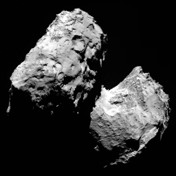
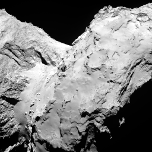
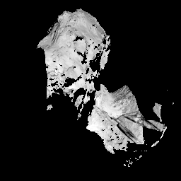
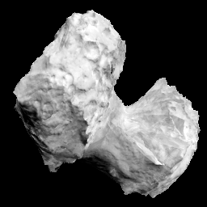

# Scripts for processing Rosetta OSIRIS imagery of the comet CG-67P

This directory contains several scripts that automate the projection of
OSIRIS imagery into different viewing geometry. Because of how irregular
the comet is, the standard map projection process is not applicable.

## User Scripts

These are the three main scripts for projecting Rosetta OSIRIS imagery.

### compute_orientation.py

  This script generates an artificial perspective image for use with the other
  reprojection scripts. Unlike the rest of the scripts, this is a python script.
  It's intended to be used within a python environment defined by the
  environment.yml file. For this reason, it needs to be called using
  `python compute_orientation.py <args>`.

### ros_osiris_reproject_serial.sh

  This script projects a list of images one at a time and then mosaics them.

### ros_osiris_reproject_parallel.sh

  This script projects a list of images in parallel by dispatching to a cluster.
  It is setup for use with the Nebula cluster at the USGS Astrogeology Science
  Center, but the sbatch commands can be modified to work with any other
  cluster that uses SLURM.

## Helper Scripts

These scripts are used by other scripts. However, they can be run by
themselves, but the main user scripts are generally more user friendly.

### ros_osiris_reproject_image.sh

  This script takes a single image from ingestion to projection into the new
  viewing geometry.

### ros_osiris_mosaic.sh

  This script mosaics a set of projected images into a single averaged image.

For more details and usage of any of these scripts see the documentation inside
each of them.

# The projection process

## Perspective Image

The perspective image is the image whose viewing geometry will be used for the
reprojection process.

## Ingestion

Before images can be processed, they must be ingested into ISIS3 cubes.
This is done using the [rososiris2isis](https://isis.astrogeology.usgs.gov/Application/presentation/Tabbed/rososiris2isis/rososiris2isis.html) application.

## Attaching SPICE data

The [spiceinit](https://isis.astrogeology.usgs.gov/Application/presentation/Tabbed/spiceinit/spiceinit.html)
application automatically determines what SPICE data should be used with each
image, except for the shapemodel. Because CG-67P is so irregular, a NAIF DSK
shapemodel must be used to get accurate intersections in the camera models.
So, all of the images use the ROS_CG_M004_OSPGDLR_U_V1.bds shapemodel.

## Masking

OSIRIS NAC imagery tends to have lots of shadows that will interfere with the
mosaicing process, so we apply a minimum threshold mask to remove them.

## Reprojection

The main processing step is to reproject the input imagery into the perspective
image's viewing geometry. This is done using the
[cam2cam](https://isis.astrogeology.usgs.gov/Application/presentation/Tabbed/cam2cam/cam2cam.html) application.

##  Mosaicing

The final step is to take all of the reprojected images and mosaic them into a
single composite. Normally this is done using [mapmos](https://isis.astrogeology.usgs.gov/Application/presentation/Tabbed/mapmos/mapmos.html)
or [automos](https://isis.astrogeology.usgs.gov/Application/presentation/Tabbed/automos/automos.html),
but because the imagery is unprojected, the scripts use the
[handmos](https://isis.astrogeology.usgs.gov/Application/presentation/Tabbed/handmos/handmos.html) application

